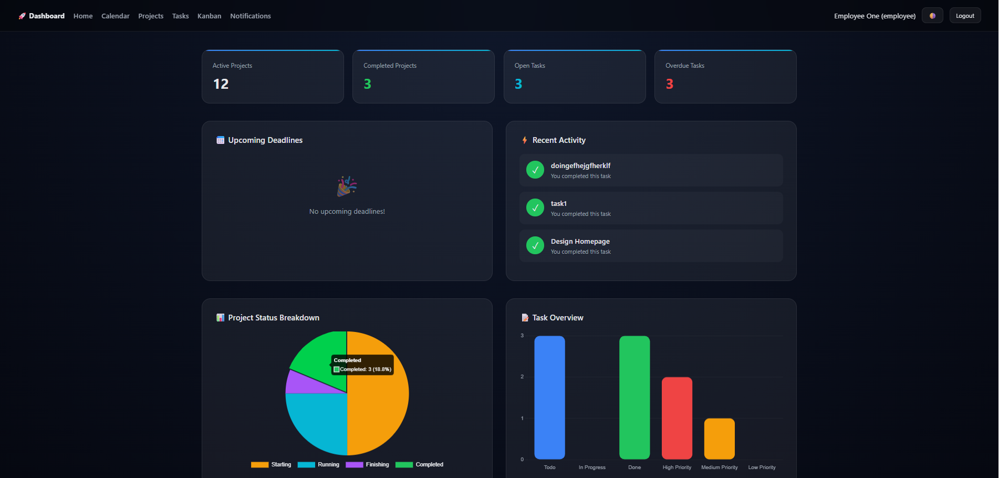

# Project Management App

Web application to manage projects, tasks and teams, built with PHP and MySQL.

## Features

- Projects and tasks management
- Kanban board
- Calendar view
- Notifications
- Comments on tasks
- Two roles: manager and employee

## Tech stack

PHP, MySQL, HTML/CSS, JavaScript

## Installation

1. Install [XAMPP](https://www.apachefriends.org/) and start Apache and MySQL.
2. Copy this project into `htdocs`.
3. Create a database in phpMyAdmin and import `database.sql`.
4. Copy `config.example.php` to `config.php` and put your database settings in it.
5. Open `http://localhost/project_version2/` in your browser.

## Demo accounts

| Role | Email | Password |
|------|-------|----------|
| Manager | manager@test.com | [password] |
| Employee | employee@test.com | [password] |

## Screenshots

## Author

Mohamed Khalil Nafeti, ISET Zaghouan
